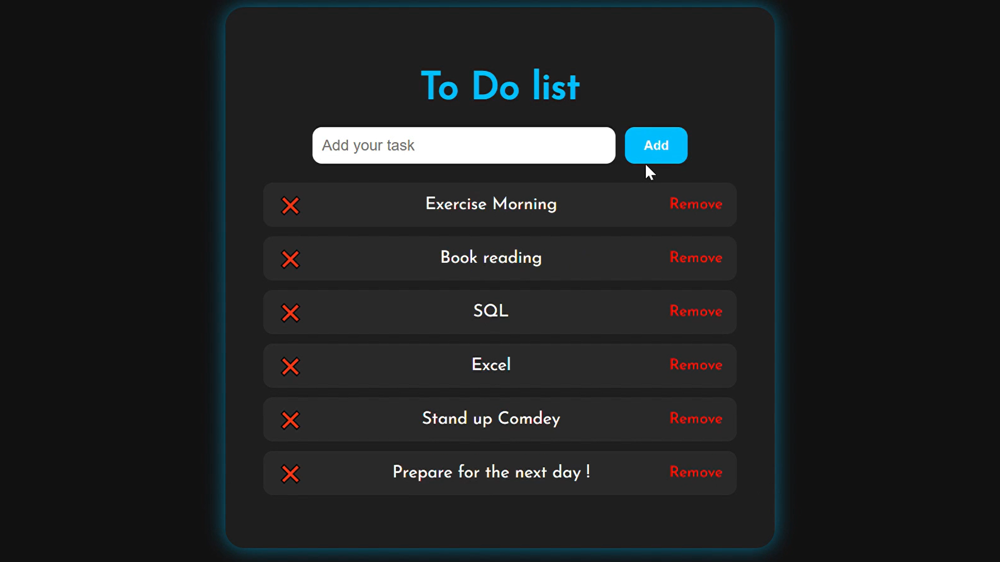

# 📝 To-Do List Website – Python Flask Mini Project

A clean and interactive To-Do List web application built using **Python** and **Flask**. This mini project allows users to manage their daily tasks — add, complete and delete them — through a simple and intuitive interface.

## 🚀 Features

- Add new daily tasks  
- Mark tasks as completed  
- Delete tasks easily  
- Simple, responsive layout  

## 🛠️ Tech Stack

- **Frontend:** HTML, CSS  
- **Backend:** Python (Flask)

## 📸 Project Screenshot

